# Relay

A local-first collaborative workspace — workspaces, projects, issues and
CRDT-backed documents, with role-based access control, live updates over
WebSockets, and a board that keeps working with the network switched off.

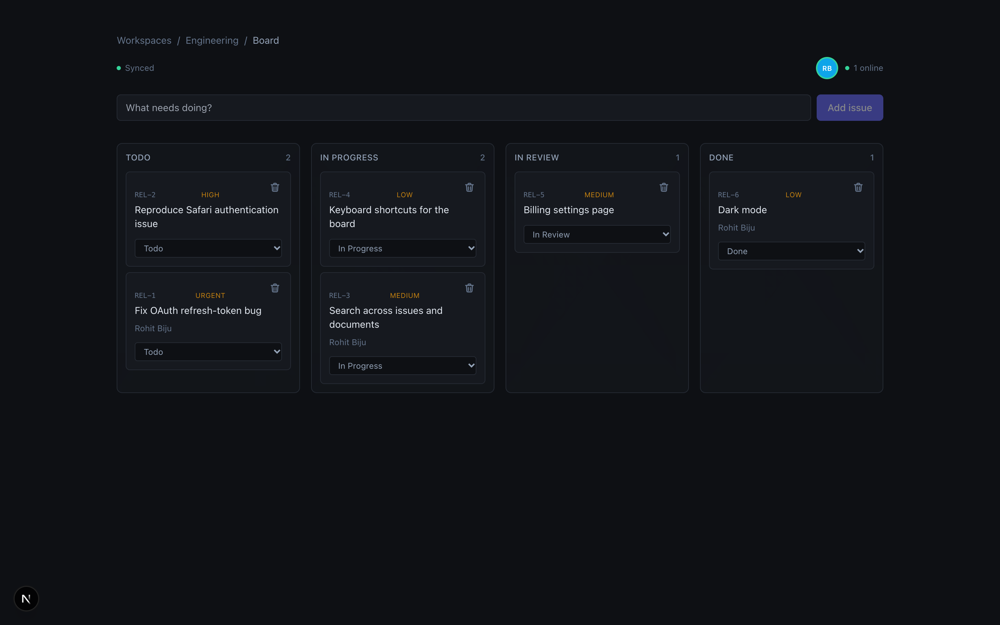

Everything below is running code. The screenshots are captured from the app by
a script, not mocked up.

---

## Quick start

You need [Bun](https://bun.sh) 1.4+. **No Docker, no Postgres install, no admin
rights** — the dev database runs from Postgres binaries fetched through npm.

### 1. Install and configure

```bash
bun install
cp .env.example .env
```

### 2. Start the database and load demo data

```bash
bun run db:start     # provisions + starts Postgres on :5433
bun run db:migrate   # applies the migration files
bun run db:seed      # 1 account, 2 projects, 10 issues
```

### 3. Run the three services

Each in its own terminal:

```bash
bun run dev:api        # REST API          → http://localhost:4000
bun run dev:realtime   # WebSocket gateway → ws://localhost:4001/ws
bun run dev:web        # Next.js client    → http://localhost:3000
bun run dev:worker     # Background jobs   (optional; needed for @mentions)
```

### 4. Sign in

Open <http://localhost:3000>.

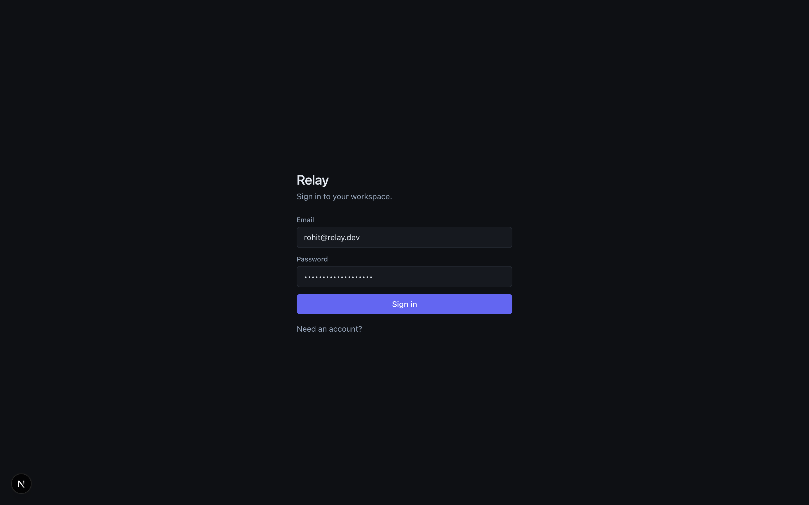

| Email             | Password              | Role  |
| ----------------- | --------------------- | ----- |
| `rohit@relay.dev` | `relay-demo-password` | OWNER |

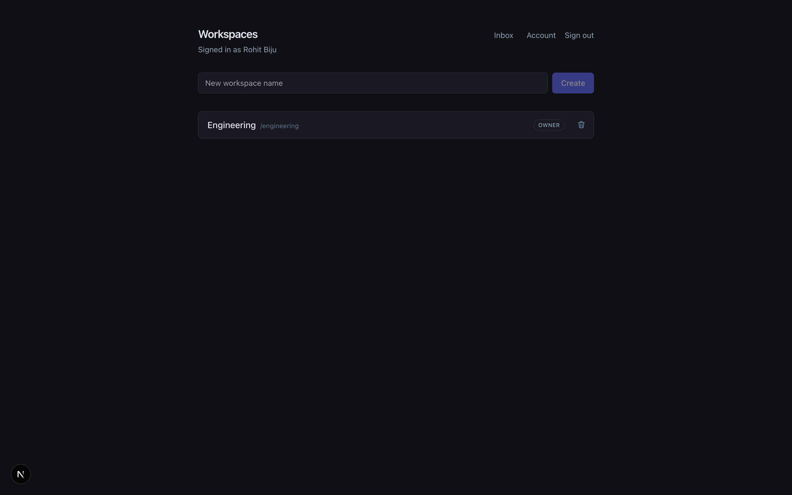

Click **Engineering** for the workspace, then a project for its board.

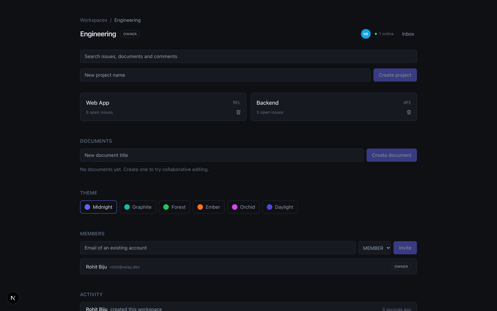


---

## See the interesting parts

### Live updates

Open the board in two windows. Create an issue in one and it appears in the
other with no reload — the WebSocket event triggers a reconcile directly, so
propagation is immediate rather than waiting on a poll.

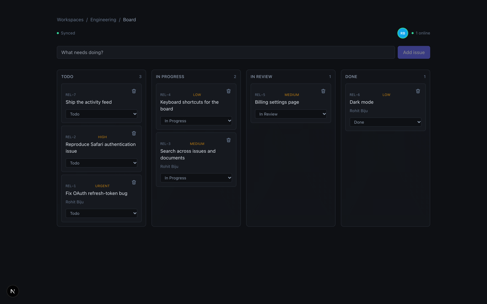

The presence bar counts distinct people, not tabs, so two windows signed in as
the same account correctly read `1 online`.

### Issues, comments and mentions

Click a card to open the issue: status, priority and assignee are editable
inline, and the title edits in place.

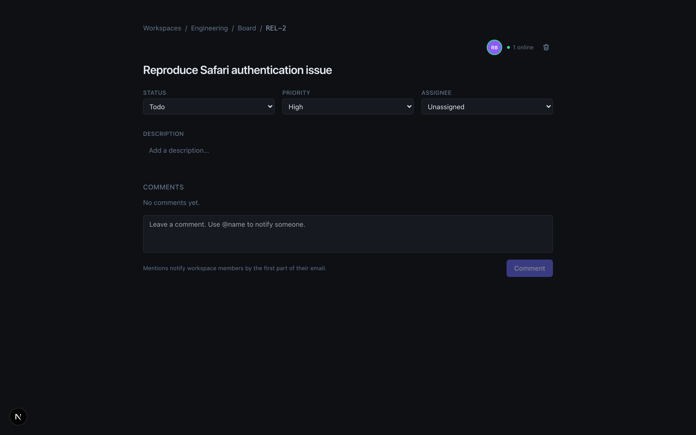

`@handle` in a comment resolves against workspace members and produces a
notification, delivered by the background worker rather than inline.

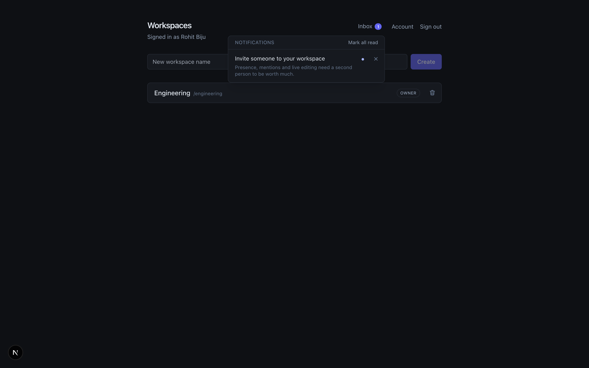

### Issue descriptions and the activity trail

The issue detail page edits its description in place. Plain text with line
breaks preserved, not Markdown — claiming to render Markdown and then only
handling some of it is worse than plainly not doing it.

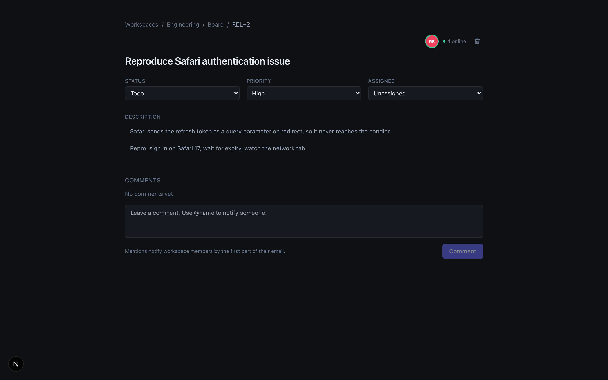

Every mutation writes an append-only audit row, and the workspace page renders
them.

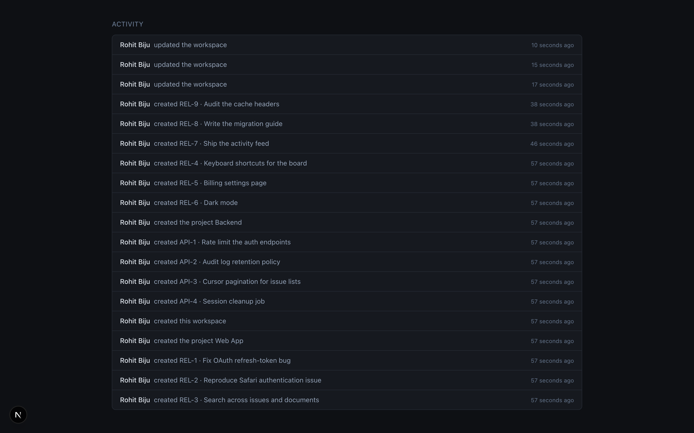

Entries describe themselves from payloads recorded at the time rather than by
joining the rows they mention, so the trail stays truthful after an issue is
deleted or a member renamed. The status-change entry above still names its
issue because the key was stored with the event, not looked up.

### Your account

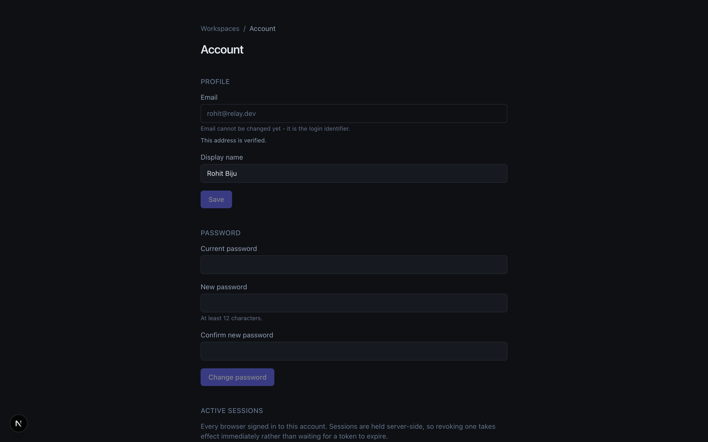

Change your display name, change your password, and see every browser signed
in to your account. Sessions are server-side, so revoking one takes effect on
the next request rather than waiting for a token to expire.

Changing a password requires the current one even though you are already
signed in — a stolen session should not be upgradeable into permanent account
takeover — and revokes every session including your own, issuing a fresh one.
If the password is being changed *because* a token leaked, sparing the current
session would defeat the exercise.

### Search

Full-text search across issues, comments and documents, scoped to one
workspace and to what you are allowed to read.

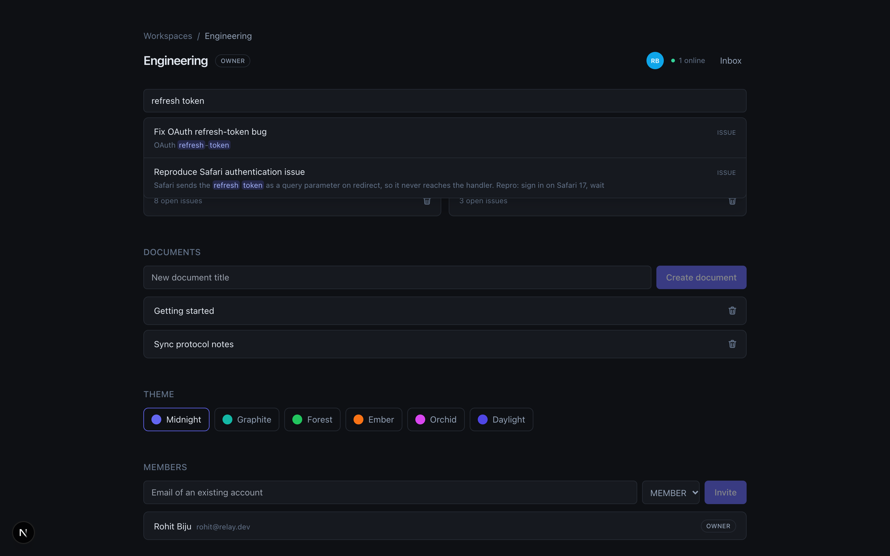

### Managing people

Invite by email, change roles, remove members. The controls mirror the server's
rules rather than reimplementing them — an admin sees no option to promote
someone to owner, and the last owner has no remove button.

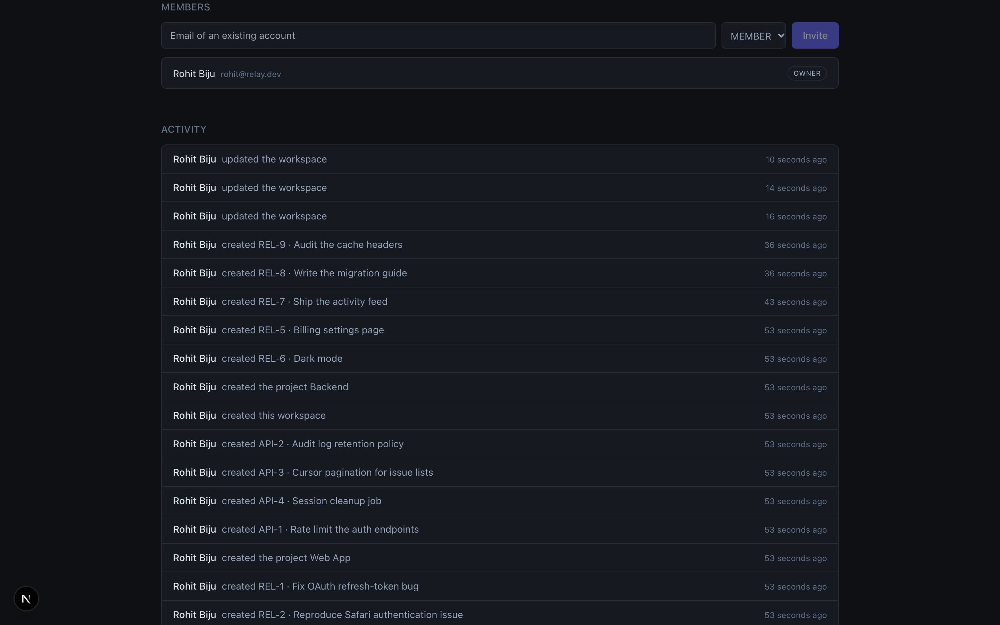

### Themes

Each workspace picks its own theme, and everyone in it sees the same one. Six
palettes, including a light one.

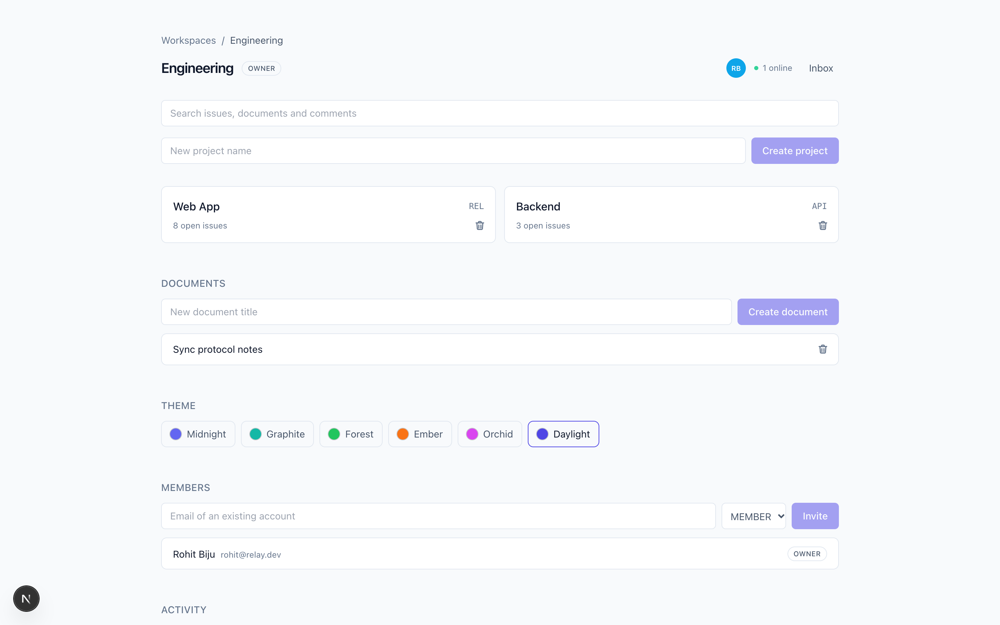

Colours resolve through CSS variables, so switching is a variable swap rather
than a class rewrite. Only surfaces and the accent are themed — status colours
stay fixed, because a red that shifts per workspace is a red nobody learns to
read.

### Nudges and guides

A background scan looks for people who could use a prompt: no workspace yet, a
project with no issues, a workspace with no documents. Clicking one opens a
short guide that ends in a button which does the thing.

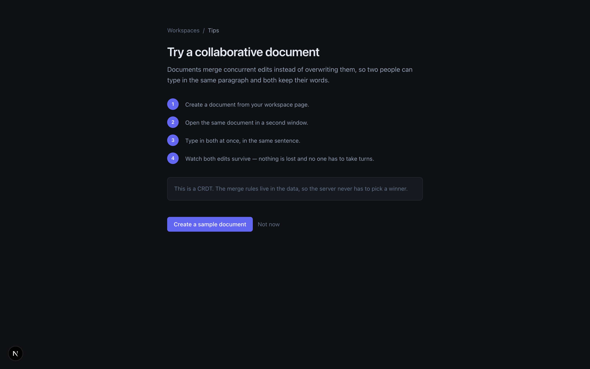

The interesting constraint is not sending them: one nudge per person per scan,
and a weekly bucket in the dedupe key so the same prompt cannot arrive twice in
a week but *can* come back later if nothing changed.

### Collaborative documents

Create a document from the workspace page and open it in two windows. Both
edit the same paragraph at once, and **both edits survive** — this is a Yjs
CRDT, so the server never picks a winner.


Issue fields merge under last-write-wins, which is fine for a status but
catastrophic for prose: two people typing in the same sentence would lose one
of the changes. Documents are the one place that genuinely needs a CRDT, which
is why they are the only place one is used.

### Working offline

On the board, cut the network (DevTools → Network → Offline, or turn off
Wi-Fi). The board keeps working — it renders from IndexedDB rather than
fetching.

Create issues with no connection. They appear immediately, outlined in amber
and marked **Unsynced**, and the header counts what is waiting.

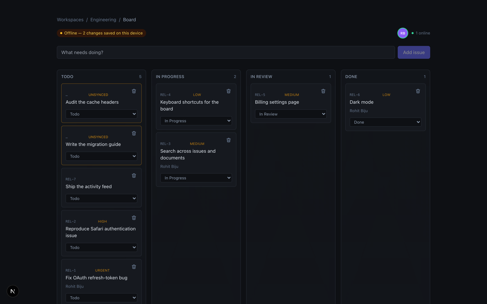

Reconnect and the queue drains by itself. The placeholder keys become real
`REL-8` / `REL-9` and the amber outlines clear.

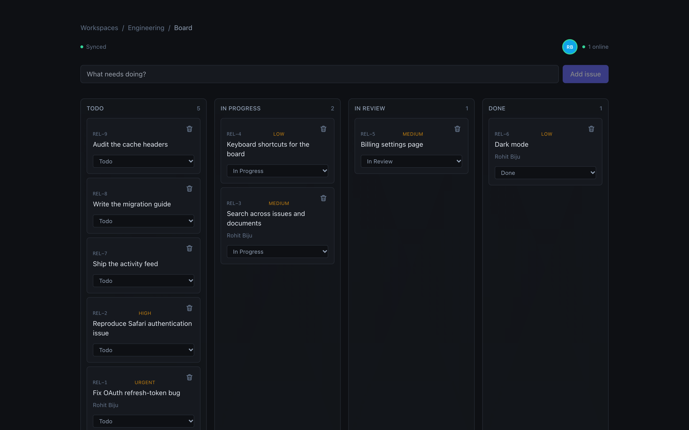

Reload the page while still offline and the board comes back — a service worker
serves the app shell from cache, and the issue store and mutation queue are read
from IndexedDB.

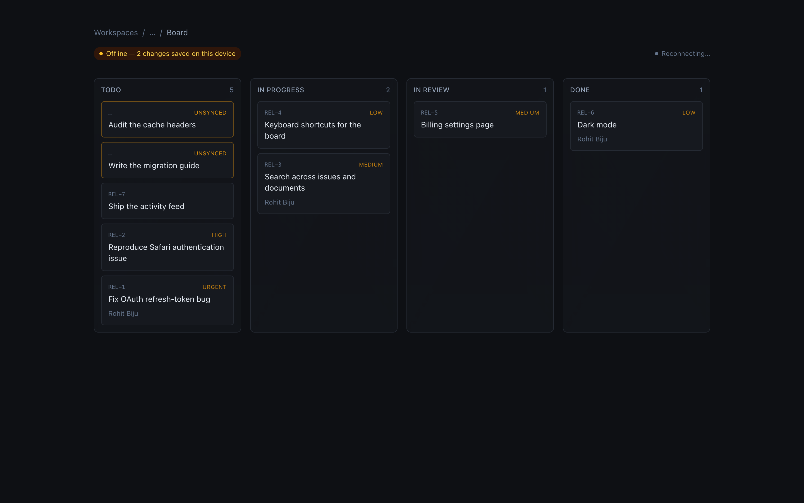

**Scope, honestly:** the board is the offline-capable route. Other pages still
fetch and will show the offline fallback if visited cold with no connection.
The service worker is network-first for navigations and cache-first for
fingerprinted assets; API and WebSocket traffic is never cached, because those
responses depend on who is asking.

### Roles and permissions

The seed creates one account, so there is nothing to see in the role model out
of the box. To exercise it:

```bash
bun run db:seed --team
```

That adds an admin, a member and a guest (all `@relay.dev`, same password).
Signing in as the guest shows the same board with the add-issue field and every
status dropdown gone — and the API returns `403` even if you send the request by
hand with `curl`.

The rules themselves are covered by
[`authorization.test.ts`](tests/authorization.test.ts) regardless of what is
seeded.

---

## Commands

| Command                 | What it does                                  |
| ----------------------- | --------------------------------------------- |
| `bun run db:start`      | Provision and start the local Postgres        |
| `bun run db:stop`       | Stop it, keeping data                         |
| `bun run db:reset`      | Destroy the data directory and re-provision   |
| `bun run db:migrate`    | Apply the migration files                     |
| `bun run db:push`       | Diff the schema straight on (fast iteration)  |
| `bun run db:seed`       | Load demo data (one account)                  |
| `bun run db:seed --team`| Add an admin, member and guest for role demos |
| `bun run grant:owner`   | Make an account OWNER of every workspace      |
| `bun run dev:api`       | REST API on :4000                             |
| `bun run dev:realtime`  | WebSocket gateway on :4001                    |
| `bun run dev:web`       | Next.js client on :3000                       |
| `bun run dev:worker`    | Background job worker                         |
| `bun test`              | Full suite against a real Postgres            |
| `bun run typecheck`     | Typecheck every package                       |
| `bun run lint`          | Biome lint + format check                     |
| `bun run lint:fix`      | Apply safe lint and format fixes              |
| `bun run loadtest`      | Measure API throughput and realtime fan-out   |

Bootstrap yourself into a fresh database:

```bash
bun run grant:owner you@example.com "Your Name" your-password
```

If you *do* have Docker, `docker compose up -d` starts the same Postgres on the
same port; skip `db:start` in that case.

---

## Architecture

```
        ┌──────────────┐
        │   Next.js    │  React 19 · TanStack Query
        │    :3000     │  presence · offline board
        └──┬────────┬──┘
           │  reads/writes go to IndexedDB first
        ┌──▼───────────┐
        │  sync engine │  durable mutation queue
        └──┬────────┬──┘
   REST +  │        │  WebSocket
   cookie  │        │  (same cookie)
        ┌──▼───┐ ┌──▼──────────┐
        │ API  │ │  Realtime   │
        │:4000 │ │  gateway    │
        │Fastify│ │   :4001    │
        └──┬───┘ └──┬──────────┘
           │        │  LISTEN
     write │        │  relay_events
           └───┬────┘
        ┌──────▼───────┐
        │  PostgreSQL  │  :5433
        │              │  NOTIFY on commit
        └──────────────┘
```

```
apps/
  api/          Fastify: routes, guards, mutations
  realtime/     Bun WebSocket gateway: fan-out, presence, document rooms
  worker/       Background job runner and handlers
  web/          Next.js client
packages/
  shared/       Permission matrix, domain enums, wire contracts
  database/     Drizzle schema, migrations, event bus, CRDT persistence
  auth/         Argon2 hashing, sessions
  sync/         Offline store, mutation queue, reconciliation
scripts/        Dev database lifecycle, seeding, admin bootstrap
tests/          Integration tests against real Postgres
docs/           Screenshots
```

`packages/shared` is imported by all three apps, so changing an event shape or a
request contract is a compile error everywhere rather than a runtime surprise.

---

## Engineering notes

The product surface is deliberately ordinary. These are the parts that weren't.

### Non-members get 404, not 403

The obvious rejection for someone else's workspace is `403 Forbidden`. That
answer confirms the workspace exists, turning the endpoint into an oracle:
iterate over ids and the 403/404 split maps out the tenant space.

[`requireMembership`](apps/api/src/plugins/authz.ts) returns **404** when there
is no membership row, and 403 only when a member lacks a specific permission —
at which point they already know the workspace exists.

### Authorization is a matrix, not scattered conditionals

Every check resolves to `can(role, permission)` against a table in
[`rbac.ts`](packages/shared/src/rbac.ts). Roles are built by extension, and a
test asserts they stay cumulative, so no role can ever do something its senior
cannot. Rules needing more than the actor's role live beside their data: an
admin cannot promote to owner, nobody can change their own role, and the last
owner cannot be demoted, removed, or leave.

The gateway and the API share one
[`findMembership`](packages/database/src/queries.ts) — two copies of an
authorization query is how they drift apart.

### Realtime runs on Postgres NOTIFY, not Redis

The plan called for Redis pub/sub. Postgres does it here, for one principled
reason and one practical one.

**`NOTIFY` is transactional.** A notification emitted inside a transaction is
delivered only if that transaction commits. Publishing to Redis from inside a
database transaction has no such guarantee — the message can go out and then the
write can roll back, leaving every client refetching stale data. Getting that
right against Redis needs an outbox table and a relay process; here it is free.
There is [a test](tests/realtime.test.ts) asserting a rejected write emits no
event.

**Practically**, it is one fewer service, and this machine has no Redis.

The cost is real: notifications are fire-and-forget with no persistence, the
payload caps at 8000 bytes, and each listener holds an idle connection. At high
fan-out Redis is the right replacement — but only
[two functions](packages/database/src/events.ts) would change.

### Events carry ids, never row contents

A payload would have to be filtered per recipient — an event about an issue must
not leak fields to someone whose role cannot read them — and would go stale
between publish and delivery. Sending an id and letting the client refetch
through the normal authorized endpoint keeps **one** authorization path instead
of two, and makes a missed event during reconnect self-healing.

### Presence is in memory, gossiped between instances

Presence changes on every navigation and heartbeat, and none of it is worth
durability. Writing it to Postgres would turn a read-mostly database into a
write-heavy one for data that is meaningless in thirty seconds.

So it lives in memory per gateway instance, and instances exchange deltas over
the same NOTIFY channel. A gateway that dies would leave ghosts, so every entry
carries a `lastSeenAt` refreshed by the client heartbeat and
[a sweeper](apps/realtime/src/presence.ts) drops stale ones. Redis with per-key
TTLs would remove the sweep.

### The gateway is a separate process

Long-lived sockets and short request/response traffic scale differently — one is
bounded by memory and file descriptors, the other by CPU — and separating them
means deploying the API does not drop every open connection.

### Issue numbering is a row lock, not a read-then-write

Human-readable keys (`REL-104`) need a per-project counter. Reading the maximum
and adding one races. Instead each create runs
`UPDATE projects SET issue_counter = issue_counter + 1 ... RETURNING` inside the
insert transaction, taking a row-level lock. A test fires 25 simultaneous
creates and asserts the results are exactly `1..25` — contiguous, proving
nothing collided *and* nothing was skipped.

### The local store is the source of truth for the UI

The board reads from IndexedDB and writes to it, then reconciles. Nothing in the
render path awaits the network, which is what makes it work offline rather than
merely degrade gracefully.

The inversion that makes this safe: **the local store is authoritative for the
UI, the server is authoritative for the world.** Reconciliation overwrites local
rows with server state — except rows with unflushed mutations, which keep their
local values, because discarding them would silently destroy work the user can
see on screen. There is
[a test](tests/sync.test.ts) for exactly that.

The engine talks to a
[`StorageAdapter`](packages/sync/src/storage.ts) and a `SyncTransport` rather
than to IndexedDB and `fetch`, so the interesting logic — queue ordering, retry
policy, convergence — is unit-testable with no browser and no server.

### Offline writes need exactly-once delivery, not at-least-once

A queued mutation that is replayed after an ambiguous failure — request sent,
response lost — must not apply twice. "Create issue" retried naively produces
two issues.

Two mechanisms together give exactly-once:

**The client names the row.** An offline create generates its own uuid, so the
issue can be rendered, referenced and edited before the server has heard of it.
A replayed insert then collides on the primary key instead of producing a second
row.

**The server keeps an idempotency ledger.** Each mutation carries a stable key;
[`withIdempotency`](apps/api/src/plugins/idempotency.ts) claims it with an
atomic `INSERT ... ON CONFLICT DO NOTHING`, and a replay returns the stored
response instead of re-running the handler. Reusing a key with a *different*
body is a 409 rather than a silent replay, because that is a client bug worth
surfacing. A failed attempt releases its key, so a transient error does not
poison it permanently.

### A poison message must not wedge the queue

The queue flushes in order and stops at the first transient failure — a create
that has not landed must not be overtaken by an edit against it.

But a 4xx means the server understood and refused, and retrying forever would
block every later mutation behind it. Those are dropped and the local change
rolled back. 408 and 429 are explicitly treated as transient, since they mean
"later", not "no".

### Documents are stored as CRDT bytes, not text

`documents` holds a compacted Yjs snapshot; `document_updates` is an
append-only log of updates recorded after it. Writing a full snapshot per
keystroke would rewrite the whole document for a one-character change, so
appending keeps a write proportional to the edit. Compaction folds the log back
in past a threshold.

It needs no transaction. Compaction is bounded by the highest sequence number
it read, so an edit arriving mid-compaction survives; and if the process dies
between writing the snapshot and deleting the log, the log is simply reapplied
on load. Yjs updates are idempotent, so the result is identical.

The content column is `bytea` rather than text because the merge rules live in
the data structure. Storing plain text would force the server to choose a
winner, which is the thing CRDTs exist to avoid.

### The gateway serialises messages per connection

Handlers are async, and the runtime does not wait for one to finish before
delivering the next. A client sending `subscribe` immediately followed by
`doc.open` raced: the second ran while the first was still awaiting its
membership lookup, saw no workspace on the socket, and was rejected — leaving
the editor stuck on "Connecting…". Messages are now chained per connection so
observable order matches wire order.

### "Online" means reachable, not connected

`navigator.onLine` is false only when there is no network interface at all.
Behind a captive portal, or against a server that is down, it happily reports
true — which showed up in testing as the UI claiming "Synced" while every
request was failing.

The indicator now requires both signals: an interface *and* a sync attempt that
actually succeeded. Retries keep running whenever an interface exists, because
a failure is exactly the state that needs re-testing and a recovering server
emits no `online` event to wake anything up.

### The job queue is Postgres, for the same reason the event bus is

`SKIP LOCKED` gives multi-worker claiming without a broker: each worker's
transaction locks the rows it selects and skips rows another worker already
holds, so batches are disjoint with no coordinator.

The reason to prefer it here is the same one that chose `NOTIFY` over Redis --
**enqueue can join the transaction that caused it**. Posting a comment inserts
the row and schedules its notification job atomically, so there is no window
where the comment exists and the job was lost, and no job for a comment that
rolled back. An external broker needs an outbox table to match that, which is
what this already is.

Delivery is at-least-once: a worker that stalls past the visibility timeout has
its job reclaimed and re-run, so handlers must be idempotent. The mention
handler relies on a unique index over `(user_id, kind, entity_id)` to make a
redelivery a no-op rather than a second notification — there is
[a test](tests/queue.test.ts) that runs it three times and asserts one row.

What Postgres does not give: this polls rather than blocking on a socket, and
throughput is bounded by the database. Those are the numbers to watch before
reaching for a broker.

### Development runs migrations, not `push`

`drizzle-kit push` diffs the schema straight onto the database, which is
convenient while iterating and dangerous as a default: it means development
executes SQL that CI and the tests never run.

That divergence hid a real bug. A unique index existed in the migration and in
`schema.ts`, the tests applied the migration and passed, and a pushed dev
database was missing it — so the mention handler failed on `ON CONFLICT` in
dev while every test stayed green. `bun run db:migrate` is now the documented
path, so all three environments execute the same statements.

### Nudges are rate-limited by their dedupe key, not by a timer

The only real failure mode for engagement prompts is becoming noise. Two rules
handle it. A scan sends **one** nudge per person even when they trip several
rules, ordered by how early they are in the funnel — suggesting they invite a
teammate to an empty workspace is worse than useless. And the dedupe key
carries an ISO week, so `(user, dedupe_key)` being unique means the same prompt
cannot arrive twice in a week but *can* return later if nothing improved.

That also makes the scan job safely re-runnable, which matters because the
queue is at-least-once. A cooldown checked with a read-then-write would let two
concurrent scans both decide the nudge was missing.

### Search is Postgres, and the index cannot drift

`search_vector` is a **stored generated column**, so Postgres recomputes it
inside the same write that changes the row. There is no indexing pipeline to
fall behind, fail quietly, or reconcile after a restore, and a freshly created
issue is findable in the same transaction that made it. Titles carry weight A
and bodies weight B, so a term in the title outranks the same term buried in a
description.

Queries go through `websearch_to_tsquery`, which accepts quoted phrases and
leading `-` for exclusion and — unlike `to_tsquery` — never throws on
punctuation a user happens to type into a search box.

What this does not give you: fuzzy matching, typo tolerance, or ranking as
tunable as a purpose-built engine. Those are the reasons to adopt one. The word
"search" is not.

### Metrics label the route pattern, never the URL

`/metrics` on the API and the gateway serves Prometheus text, written by hand
rather than pulled from `prom-client` — the exposition format is a few hundred
lines, and writing it keeps the parts that are easy to get subtly wrong (label
ordering, escaping, cumulative buckets) visible and tested.

The decision that actually matters is what goes in a label. Every distinct set
of label values is a separate time series, held in memory for the life of the
process and indexed forever by whatever scrapes it. So the `route` label
carries the *pattern* — `/workspaces/:workspaceId/issues/:issueId` — and never
the requested path. Labelling the path would mint a series per issue anyone
has ever opened: unbounded memory, an unbounded index, and a dashboard that
cannot aggregate because no two requests share a series. Requests matching no
route collapse to `__unmatched__` for the same reason; a 404 sweep is exactly
the traffic that would otherwise explode the registry.

The same rule applies on the gateway, where the message `type` arrives from
the client: it is checked against the known kinds and anything else counts as
`unknown`, so `{"type":"<random>"}` in a loop cannot grow the registry.

Metrics therefore declare their label names up front and reject anything else.
A typo raises at the call site instead of silently opening a parallel series
that never merges with the real one. No label carries a workspace id, user id
or email — metrics tend to be the least access-controlled surface a service
has, so they hold operational shape and nothing about who was asking, which is
also why the endpoint needs no session.

### Rate limiting is in memory, and honest about it

A fixed window and a counter, per account when signed in and per address when
not — which is where credential stuffing lives. Argon2 makes each login
deliberately expensive, which protects the password and simultaneously makes
login a cheap way to burn server CPU; the limit protects the server.

Behind several instances each enforces its own share, so the effective limit is
`limit × instances`. That is looser than intended but still bounded, and the
failure mode is permissive rather than locking people out. A shared store is
the fix when that matters. The limits are injectable, so the tests exercise the
limiter with a budget of three instead of switching it off.

### Trim before validate, not after

Every text schema was written `z.string().min(1).max(80).trim()`. Zod applies
`.trim()` as a *transform*, after the checks — so `"   "` passed `min(1)`, was
then trimmed, and stored as `""`. Whitespace-only names, issue titles and
comment bodies were all accepted and silently became empty.

The fix is ordering: `z.string().trim().min(1).max(80)`. The bug was found by
a test asserting a blank display name is rejected, which is the argument for
writing the rejection cases rather than only the happy path.

### Paging by cursor, and why the cursor holds only an id

`OFFSET n` re-counts from the start on every page. That is slower as pages
deepen and, more importantly, wrong under concurrent writes: a row inserted
before the current page shifts everything down, so the reader skips one row and
sees another twice, with nothing in the response admitting it.

The cursor names the last row seen instead. What it deliberately does *not*
carry is that row's timestamp. Postgres stores `timestamptz` to microseconds
and a JavaScript `Date` holds milliseconds, so round-tripping the sort key
through JSON truncates it — the cursor lands fractionally before the row it
names and the next page steps over everything in the gap. Invisible until
several rows share a millisecond, which is exactly what a burst of concurrent
inserts produces. Resolving the sort key from the id inside the query costs one
primary-key lookup and removes the conversion entirely.

### Sessions are opaque, not JWTs

Session lookup costs one indexed read per request. In exchange, signing out
actually invalidates the session. Only the SHA-256 of the token is stored, so a
database leak doesn't hand out usable cookies — and the same session logic
authenticates the WebSocket upgrade.

Plain SHA-256 rather than Argon2 is deliberate: the token is already 256 bits of
CSPRNG output, so there is nothing to brute-force. Passwords, which *are*
low-entropy, use Argon2id.

### Login doesn't leak which emails are registered

A failed login verifies a throwaway Argon2 digest when no user matches, so the
response takes the same time either way and both failures return an identical
body.

---

## Testing

**313 tests** against a real Postgres rather than mocks. The behaviour under test
— unique constraints, cascades, row locks, transactional `NOTIFY` — is behaviour
the database provides, so a fake would only prove the fake works.

```bash
bun test
```

| Suite                   | Covers                                                          |
| ----------------------- | --------------------------------------------------------------- |
| `rbac.test.ts`          | Permission matrix, role cumulativity, rank ordering              |
| `auth.test.ts`          | Registration, login, session revocation, enumeration resistance  |
| `authorization.test.ts` | Cross-tenant access, role boundaries, escalation, last owner     |
| `issues.test.ts`        | Numbering under concurrency, assignment, cascades                |
| `realtime.test.ts`      | Socket auth, fan-out, cross-workspace isolation, presence        |
| `sync.test.ts`          | Offline queue, retry, poison messages, convergence               |
| `documents.test.ts`     | CRDT convergence, compaction, persistence round-trips            |
| `text.test.ts`          | Textarea-to-CRDT edit extraction, 500 randomised round-trips     |
| `queue.test.ts`         | `SKIP LOCKED` claiming, backoff, dead-letter, mention delivery   |
| `mentions.test.ts`      | Mention parsing, ambiguity, emails-in-prose false positives      |
| `themes.test.ts`        | Token completeness, WCAG contrast, palette-bypass guard          |
| `nudges.test.ts`        | Rule ordering, weekly dedupe, redelivery, spam resistance        |
| `search.test.ts`        | Stemming, ranking, index freshness, tenant isolation             |
| `rate-limit.test.ts`    | Budgets, headers, per-caller isolation, retryability             |
| `pagination.test.ts`    | Keyset paging, stability under concurrent inserts and deletes    |
| `stats.test.ts`         | Percentile and summary arithmetic behind the load-test numbers   |
| `metrics.test.ts`       | Exposition format, label cardinality guards, cumulative buckets   |
| `account.test.ts`       | Password change, session revocation, audit payloads, blank input  |
| `uuid.test.ts`          | The id guard every route runs before touching the database       |
| `idempotency.test.ts`   | Exactly-once mutations, key misuse, client-generated ids         |

The ones worth reading are adversarial: pasting another tenant's project id into
a URL you *do* have access to, an admin trying to promote itself past its
ceiling, a socket subscribing to a workspace it doesn't belong to, and the
25-way concurrent create.

---

## Measured performance

Numbers from `bun run loadtest`, which spawns the API and gateway as separate
processes and drives them from a third. **These are laptop numbers, not a
capacity plan** — one machine, loopback networking, local Postgres, and a CPU
that throttles. They are here because the alternative was describing behaviour
and quietly implying throughput.

Median of three consecutive runs on an M-series MacBook Pro (14 cores, Bun
1.4.2, Postgres 18). Full spread is given where it is wide.

**REST API** — 32 concurrent connections, 4 projects, 20% writes, 10s measured
after a 3s warmup:

| Operation             | p50    | p95    | p99    |
| --------------------- | ------ | ------ | ------ |
| Read (list 25 issues) | 6.4 ms | 8.1 ms | 9.6 ms |
| Write (create issue)  | 9.8 ms | 11.8 ms| 13.5 ms|

**~4,400 req/s**, zero errors. Across the three runs throughput was 3,354 /
4,386 / 4,424 req/s — the first run of a session is consistently the slowest
even after the warmup, which is the Postgres page cache filling.

**Realtime fan-out** — 50 subscribed sockets, 20 events/s offered for 10s,
measured from the moment the write is issued to the moment each subscriber has
the event:

| Stage                     | p50    | p95    | p99     |
| ------------------------- | ------ | ------ | ------- |
| Write acknowledged (HTTP) | 5.4 ms | 7.6 ms | 11.5 ms |
| First subscriber has it   | 5.4 ms | 7.6 ms | 11.4 ms |
| *All 50* subscribers      | 5.8 ms | 8.0 ms | 11.9 ms |

**100% delivery** — 29,500 of 29,500 expected receipts across the three runs,
none dropped. The gap between the first and the last subscriber is ~0.4 ms at
p50, which is the cost of the fan-out loop itself; the rest is the write.

### Reading these honestly

- **The API phase is closed-loop**, so it describes latency *at that
  concurrency* and structurally cannot show queue collapse. The fan-out phase
  is open-loop — events are offered on a fixed schedule regardless of whether
  the last one finished — because coordinated omission would otherwise hide the
  backlog the test exists to find.
- **Throughput is flat in concurrency; latency is linear in it.** A sweep from
  4 to 64 connections held throughput near its ceiling while p50 tracked
  Little's Law almost exactly (64 connections: 29.5 ms predicted, 28.3 ms
  measured). Past roughly 8 connections this machine buys queueing delay, not
  work.
- **The load generator is not the bottleneck.** It reports its own event-loop
  lag every run — p99 under 2 ms throughout — which is what makes the delivery
  figures the gateway's rather than the harness's. The subscribers share a
  process with the generator, so that lag is *inside* the fan-out numbers.
- **A larger database pool did not help.** Raising it from 10 to 60 looked like
  a 2× win until the runs were interleaved, at which point the effect vanished
  into run-to-run variance. It is not a finding, so it is not claimed as one.

The harness is Bun rather than k6 — k6 ships as a Go binary and this machine has
no way to install one. The tradeoff k6 would have removed is that the generator
runs on the same runtime as the system under test, which is exactly why the
event-loop lag is reported alongside every result.

---

## Status

**Done**

- Multi-tenant workspaces, four-role RBAC, audit trail
- Session auth (Argon2id, opaque server-side sessions)
- Projects and issues with per-project keys, comments
- Realtime updates and presence over WebSockets
- Offline-first board: IndexedDB store, durable mutation queue, exactly-once sync
- Service worker so the app shell loads with no network
- CRDT documents (Yjs) with live cursors, stored as an append-only update log
- Background job queue on Postgres `SKIP LOCKED`, with `@mention` notifications
- Issue detail pages, comment threads, and a notification inbox
- Per-workspace themes, and engagement nudges that open a how-to guide
- Full-text search over issues, comments and documents
- Member management UI and rate limiting on credential endpoints
- Delete for every entity, confirmed, with board deletes going through the
  offline queue like any other write
- Next.js client with optimistic updates
- Load harness with measured throughput and fan-out numbers
- Prometheus metrics on the API and the gateway
- Editable issue descriptions, workspace activity feed, account settings
- 313 tests, CI, linting, typechecking

**Next**

- File uploads and email delivery (both need an external service)
- Distributed tracing (metrics are in; spans are not)
- Drag-and-drop board, editable issue descriptions, a search results page

See [docs/ROADMAP.md](docs/ROADMAP.md) for the full plan, including an honest
list of what is thin in what already exists.

Collaborative text is the one remaining piece that genuinely needs CRDTs. Issue
fields converge fine under last-write-wins per field — two people editing
different fields of the same issue both keep their change — but concurrent edits
to the *same* paragraph do not, which is what Yjs is for.

---

## Notes on the local toolchain

The dev database uses
[`embedded-postgres`](https://www.npmjs.com/package/embedded-postgres), which
ships real Postgres binaries through npm, so the repo runs with no container
runtime and no admin rights. Two wrinkles are handled in `scripts/`:

- The npm tarball loses the shared-library version symlinks the binaries link
  against, so `initdb` fails with a dyld error.
  [`fix-pg-dylibs.ts`](scripts/fix-pg-dylibs.ts) recreates them from
  `postinstall`.
- The package ships only `initdb`, `pg_ctl` and `postgres` — no `createdb` — and
  its JS wrapper spawns Postgres as a direct child, so the server dies with the
  script. [`dev-db.ts`](scripts/dev-db.ts) drives `pg_ctl` directly for a
  properly detached server and creates the database over the wire.

CI uses a plain Postgres service container instead, since it already has one.
