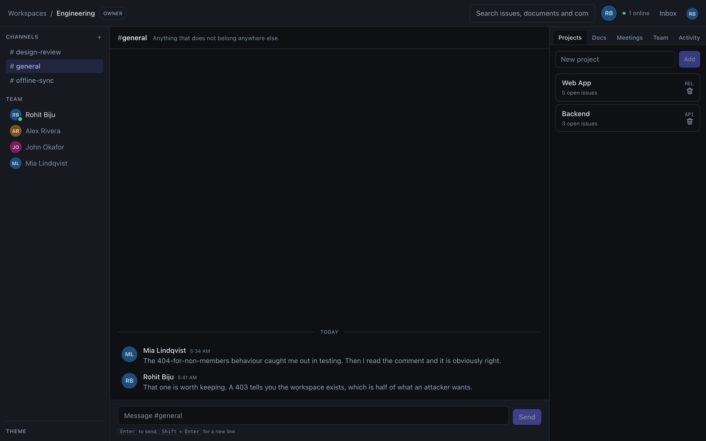
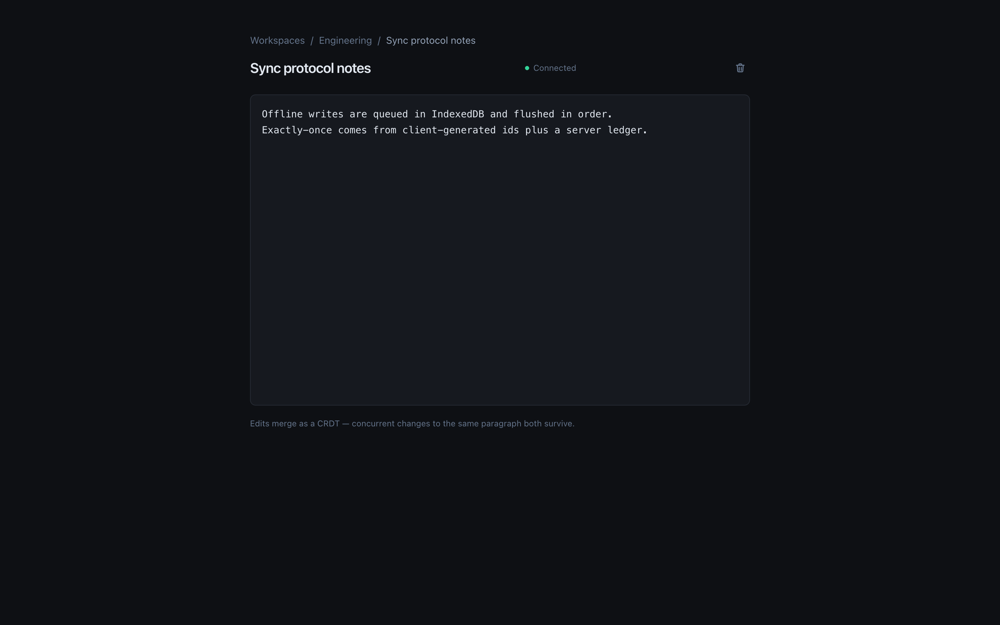
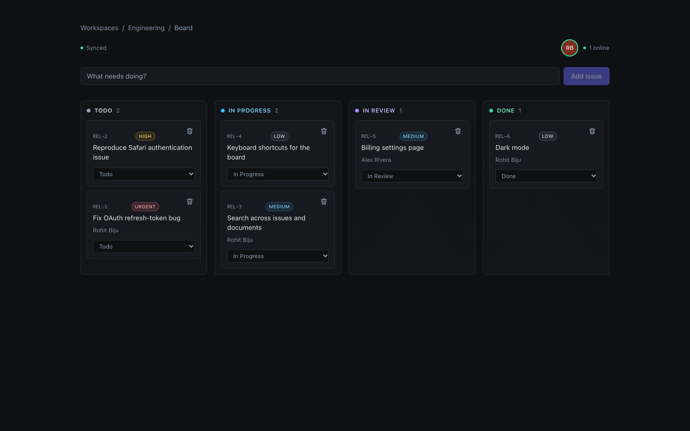
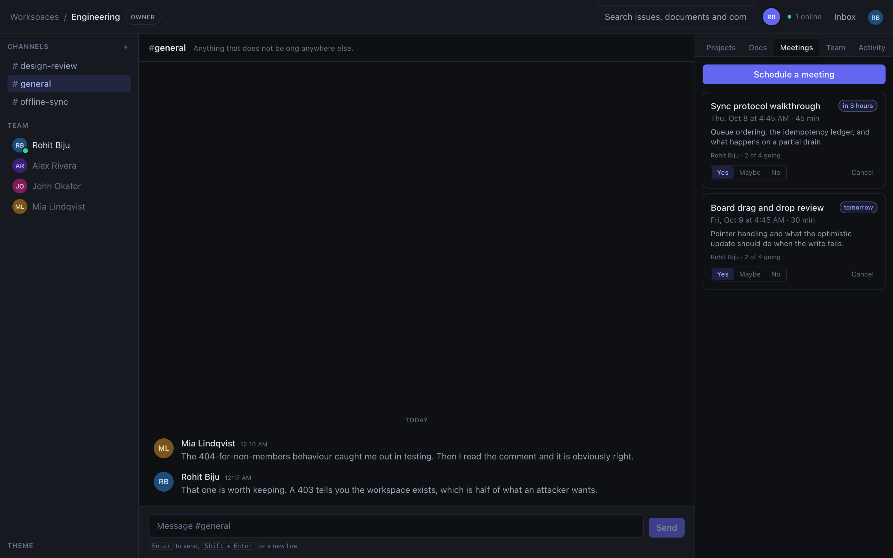
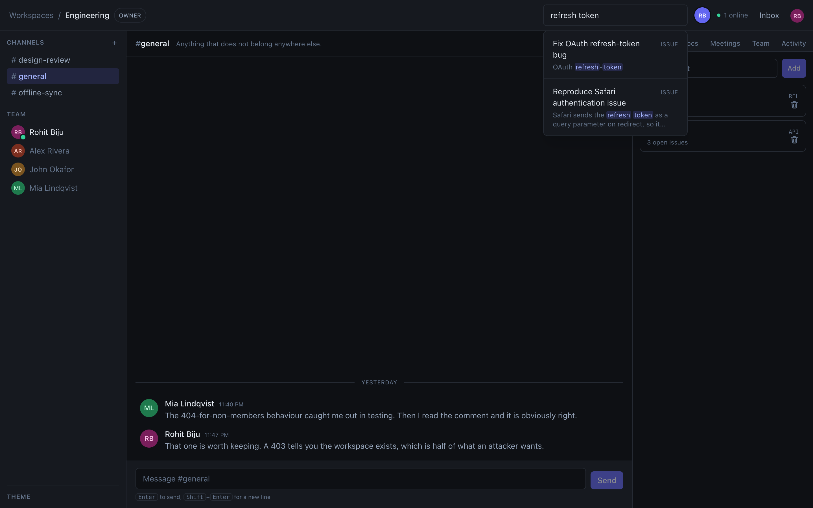
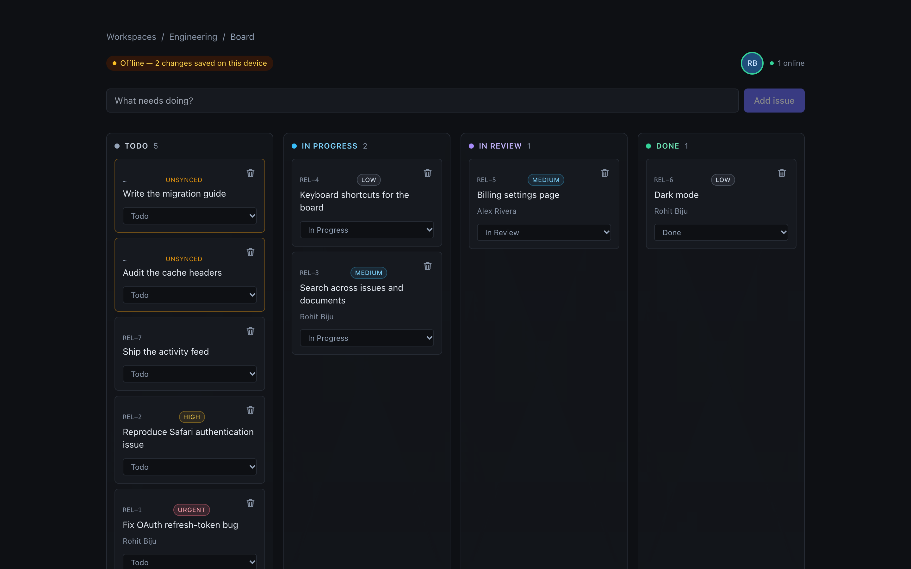
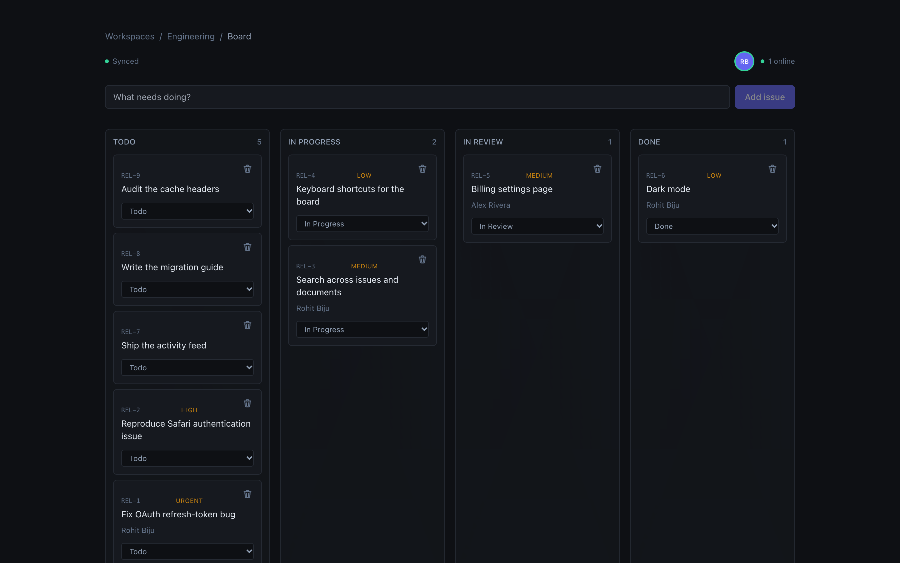

# Relay

A collaborative workspace that keeps working when the network does not.

Issues, documents, chat and meetings for a team. Every change you make offline
is queued locally and reconciles when you reconnect, exactly once.



```bash
bun install
bun run db:start && bun run db:migrate && bun run db:seed -- --team

bun run dev:api        # :4000
bun run dev:realtime   # :4001
bun run dev:worker
bun run dev:web        # :3000
```

Sign in as `rohit@relay.dev` with `relay-demo-password`.

---

## What it does

**Chat in channels.** Workspace rooms with history, moderation, and the same
permission rules as everything else.

**Documents that merge.** Two people can type in the same paragraph. Yjs CRDTs
over a WebSocket gateway, so edits converge without a lock and without losing a
keystroke.



**Issues on a board.** Projects, statuses, priorities, assignees, comments with
`@mentions`, and a full audit trail.



**Meetings.** Schedule, invite, answer. Moving the time clears everyone else's
yes, because a yes was for a time.



**Search across everything.** Issues, documents and comments, through Postgres
full-text search.



---

## Works offline

Pull the network out mid-sentence. Writes land in a durable queue in IndexedDB
and the board keeps working.



On reconnect the queue drains in order. A server-side ledger keyed by a
client-generated id means a retry after an ambiguous failure cannot create the
same issue twice.



---

## Measured, not estimated

From the load harness in this repository (`bun run loadtest`), on one laptop
with Postgres on the same machine.

| Operation             | p50    | p95     | p99     |
| --------------------- | ------ | ------- | ------- |
| Read (list 25 issues) | 6.4 ms | 8.1 ms  | 9.6 ms  |
| Write (create issue)  | 9.8 ms | 11.8 ms | 13.5 ms |

**~4,400 requests/second, zero errors.** A write reaches all 50 subscribed
clients in 5.8 ms at p50.

---

## How it is put together

```
frontend/        Next.js 15, React 19, Tailwind
backend/
  api/           Fastify HTTP API
  realtime/      Bun WebSocket gateway: fan-out, presence, document rooms
  worker/        background jobs
  auth/          Argon2id passwords, opaque sessions
  database/      Drizzle schema and migrations
  mailer/        mail port plus drivers
  metrics/       Prometheus registry
shared/
  contracts/     Zod schemas, the permission matrix, wire events
  sync/          offline queue, CRDT glue
relay-ml/        duplicate detection and priority triage (Python)
```

`shared/` is a third top-level directory rather than a folder inside
`backend/`, because the frontend genuinely imports it: `@relay/shared` and
`@relay/sync` are its only two workspace dependencies. Filing them under the
backend would misdescribe who uses them. The package is still named
`@relay/shared`; the directory is `contracts` because that is what is in it.

Four roles, one declarative permission matrix. Non-members get **404, not
403** — a 403 confirms the workspace exists, which is half of what an attacker
wants.

### A few decisions, and why

| Choice                    | Instead of     | Because                                                                                                         |
| ------------------------- | -------------- | --------------------------------------------------------------------------------------------------------------- |
| Postgres `LISTEN/NOTIFY`  | Redis pub/sub  | The event publishes in the same transaction as the write, so an event cannot exist for a change that rolled back |
| Postgres `SKIP LOCKED`    | a queue broker | Jobs enqueue transactionally with the work that causes them. One fewer service to run                            |
| Keyset pagination         | `OFFSET`       | `OFFSET` re-counts every page and shifts under concurrent inserts, so readers skip rows and see others twice     |
| Opaque sessions           | JWTs           | A session dies the moment a password changes. A signed token stays valid until it expires                        |
| Postgres full-text search | Elasticsearch  | A stored generated `tsvector` cannot drift from the row it describes                                             |

Several of these are also "one fewer thing to run on a laptop with no Docker".
That constraint is real and is stated rather than dressed up.

The long version, with the rejected alternatives spelled out, is in
**[docs/ARCHITECTURE.md](docs/ARCHITECTURE.md)**.

---

## Machine learning

`relay-ml/` finds possible duplicate issues and suggests a priority. Both are
advisory; nothing acts on a prediction.

TF-IDF rather than transformer embeddings, because one workspace's issues are
short and full of shared project vocabulary. The limitation is documented
honestly: "auth" matches at 0.64 where "authentication" matches at 0.26 for the
same intent. Below 40 triaged issues the model **declines to predict** rather
than returning a confident-looking guess.

It is not wired into the API and is unauthenticated, so it is not deployable as
it stands. See **[relay-ml/README.md](relay-ml/README.md)**.

---

## Commands

| Command               | What it does                         |
| --------------------- | ------------------------------------ |
| `bun test`            | 393 tests                            |
| `bun run typecheck`   | every package                        |
| `bun run lint`        | Biome                                |
| `bun run loadtest`    | the benchmark above                  |
| `bun run screenshots` | recapture every image in this README |
| `bun run db:reset`    | drop and recreate the dev database   |

Every screenshot here is produced by that script driving a real Chrome against
the real stack. None of them is a mockup.

---

## Status

A portfolio project, built to be read. It runs locally and is tested. It has
not been deployed, and three things are missing because this machine has no
Docker and no SMTP: file uploads, a verified container build, and a production
mail driver. The API **refuses to start in production** without a mail driver
rather than printing reset links into a log.

Nothing here is a security or compliance claim. It describes what the code does
and what was measured.

What is next is in **[docs/ROADMAP.md](docs/ROADMAP.md)**.
